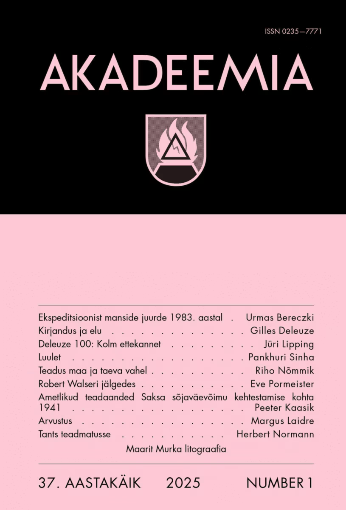
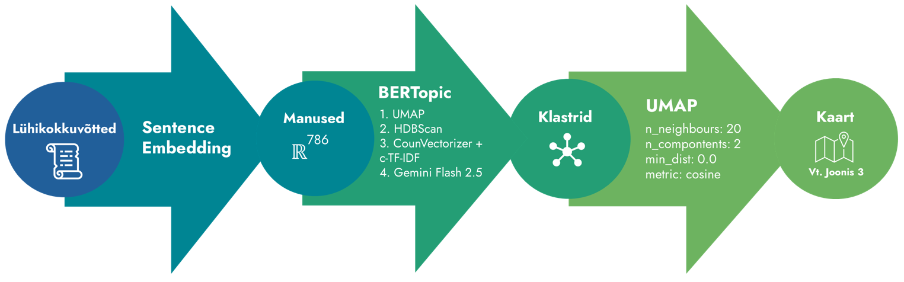
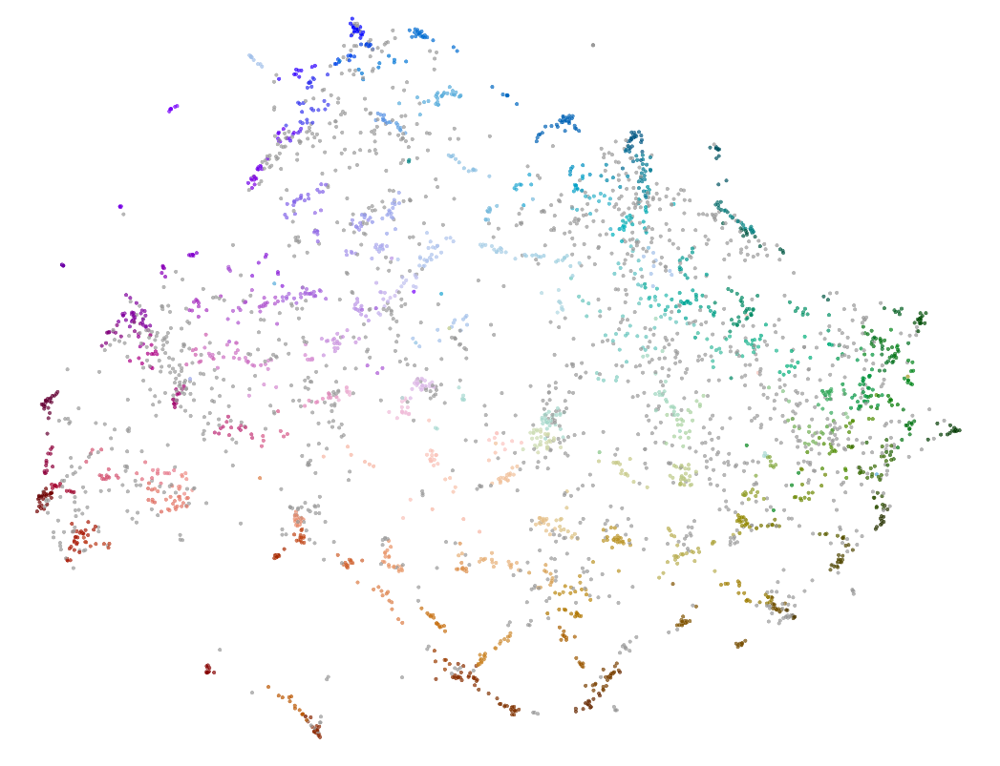
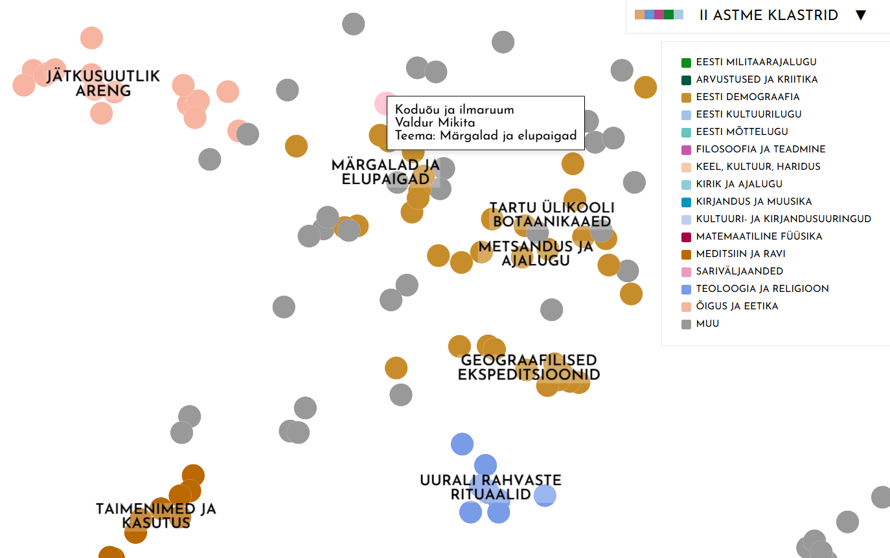

# Kultuuriajakirja AKADEEMIA kaardistamine

**Autorid:** Hendrik Matvejev (informaatika, BA III) ja Riki-Taavi Nurm (matemaatika, BA III)

## Sissejuhatus

Akadeemia on alates 1989. aasta aprillist igakuiselt ilmuv kultuuriajakiri, mille eesmärk on vahendada eri teadusharude tänapäevast taset ja arengut [3]. Veebilehel Akad.ee on kättesaadavad kõigi numbrite sisukorrad tekstina ning nende sisu PDF-failidena. 

Veebilehe otsing toimub võtmesõnaliselt nende sisukordade peal, seega puudub semantilise otsingu võimalus. Selle probleemi lahendamiseks lõime veebilehe ja masinõppe andmetöötlusahela, mis muudab Akadeemia arhiivi semantiliselt otsitavaks ja interaktiivseks, kaardistades suurem osa ilmunud artiklitest. 

Inspiratsiooniks oli sarnane projekt OpenSyllabus Galaxy [2].

*Märkus: Veebilehele pääseb [https://akadeemia-arhiiv-120962177191.europe-north1.run.app/].*

---

## Andmete kogumine ja puhastamine

Ajakirja artiklitest ei eksisteerinud avalikku digitaalset andmestikku, mistõttu pidime selle ise looma. Protsess nägi ette järgmist:

* **Andmekorje:** Laadisime Akad.ee arhiivist alla numbrite HTML-sisukorrad (mis sisaldasid käsitsi sisestamisest tulenevaid ebakõlasid ja vormindusvigu).
* **Failide hankimine:** Laadisime alla vastavate numbrite PDF-failid Akadeemia veebilehelt ning Digari arhiivist [7] (mõne numbri skanneeringud olid puudu või osaliselt olemas).
* **Segmenteerimine:** Jagasime PDF-failid üksikuteks artikliteks sisukorra andmestiku järgi, kasutades optilist tekstituvastust (OCR), et leida õiged leheküljenumbrid.
* **Sisukokkuvõtete eraldamine:** Eraldasime OCR-i abil artiklite inglisekeelsed sisukokkuvõtted ning viisime need vastavusse artiklitega.
* **Puhastamine:** Kontrollisime ja puhastasime andmeid käsitsi.

**Tulemus:** Struktureeritud JSON-andmestik, mis sisaldab artiklite metaandmeid ja inglisekeelseid lühikokkuvõtteid. Andmestikus on olemas suurem osa artiklitest 1989. aasta aprillist kuni 2025. aasta veebruarini: kokku **5403 artiklit**, millest **3946** on olemas inglisekeelne lühikokkuvõte.

---

## Manuste loomine, klasterdamine ja kaardistamine

* **Vektormanused:** Kasutasime `all-mpnet-base-v2` tihedate lausevektorite mudelit [6], et luua inglisekeelsetest kokkuvõtetest 768-mõõtmelised vektormanused.
* **Klasterdamine:** Klastrite leidmiseks ning nende nimetamiseks kasutasime `BERTopic` teeki [5], mis vähendab dimensioone UMAP algoritmiga, leiab klastrid HDBScaniga, leiab peamised märksõnad CountVectorizeri/c-TF-IDF-ga ning annab klastritele pealkirjad Gemini Flash 2.5 abil.
* **Kaardistamine:** Kasutasime UMAP-algoritmi [1], et kujutada vektorid kahemõõtmelisele tasandile.

Protsessi tulemusena saime kaardistatavad andmed: artiklite 2D koordinaadid ning kolm kihti klastreid vastavate pealkirjadega.

---

## Arhiivileht ja interaktiivne kaart

Veebilehe disaini inspiratsiooniks on 2025. aasta esikaane disain. 

* **Tehnoloogia:** Veebirakendus põhineb Flaskil. Kasutajaliides rakendab 2D-projektsiooni ja loodud klastrite kuvamiseks tugevalt kohandatud `DataMapPlot` teeki [4].
* **Funktsionaalsus:** Kasutajad saavad uurida arhiivi kaardivaate kaudu, teha vabas vormis semantilisi otsinguid ja saada koosinussarnasuse skooridel põhinevaid lähimate (semantiliselt sarnaseimate) artiklite soovitusi.

Meie loodud semantiline otsing ja kaart lihtsustavad Akadeemia artiklite leidmist ning võimaldavad näha nendevahelisi, varasemalt märkamata jäänud seoseid.

---

## Viited

[1] L. McInnes, J. Healy, ja J. Melville, "UMAP: Uniform Manifold Approximation and Projection for Dimension Reduction," *arXiv*, Sep. 2020. DOI: [10.48550/arXiv.1802.03426](https://doi.org/10.48550/arXiv.1802.03426).

[2] Open Syllabus, "Open Syllabus: Galaxy," 2021. [Online]. Saadaval: [https://galaxy.opensyllabus.org/](https://galaxy.opensyllabus.org/).

[3] Akadeemia, "Akadeemia," 2026. [Online]. Saadaval: [https://www.akad.ee/](https://www.akad.ee/).

[4] L. McInnes, "DataMapPlot," 2023. [Online]. Saadaval: [https://datamapplot.readthedocs.io/en/latest/](https://datamapplot.readthedocs.io/en/latest/).

[5] M. P. Grootendorst, "BERTopic," 2024. [Online]. Saadaval: [https://maartengr.github.io/BERTopic/index.html](https://maartengr.github.io/BERTopic/index.html).

[6] UKP Lab ja Hugging Face, "sentence-transformers/all-mpnet-base-v2," Jan. 2024. [Online]. Saadaval: [https://huggingface.co/sentence-transformers/all-mpnet-base-v2](https://huggingface.co/sentence-transformers/all-mpnet-base-v2).

[7] Eesti Rahvusraamatukogu, "DIGAR," 2005. [Online]. Saadaval: [https://www.digar.ee/arhiiv](https://www.digar.ee/arhiiv).
